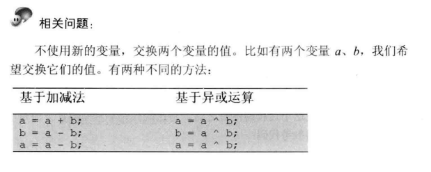

## 题目 
不用加减乘除做加法
写一个函数，求两个整数之和，要求在函数体内不得适用+，-，* ，./ 四则运算符号

## 思路
使用移位操作实现基本的运算

思路迁移到二进制：
对于二进制来讲，来看上述三步是否适用，12的二进制表示为：1100，9的二进制为：1001，
1、不考虑进位：相加结果为：0101；
2、只考虑进位：结果为：10000；
3、前两步结果相加为：10101

可见，这三步同样适用于二进制。
位运算
1、不考虑进位时，1+1=0，0+0=0，0+1=1，1+0=1，很明显可以用异或运算解决
2、考虑进位时，0+1，0+0，1+0都不会产生进位，只有1+1会产生进位，可以用‘与’操作解决，‘与’完之后向左移动一位即可；
3、重复前两步，知道不再产生进位为止。

