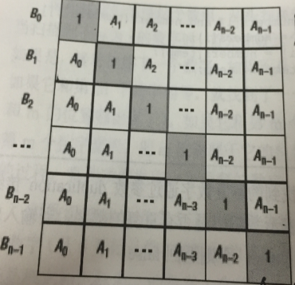

## 题目
**构建乘积数组** 
给定一个数组A[0,1,...,n-1],请构建一个数组B[0,1,...,n-1],其中B中的元素B[i]=A[0]*A[1]*...*A[i-1]*A[i+1]*...*A[n-1]。不能使用除法。

## 思路
下三角用连乘可以很容求得，上三角，从下向上也是连乘。

因此我们的思路就很清晰了，先算下三角中的连乘，即我们先算出B[i]中的一部分，然后倒过来按上三角中的分布规律，把另一部分也乘进去。

